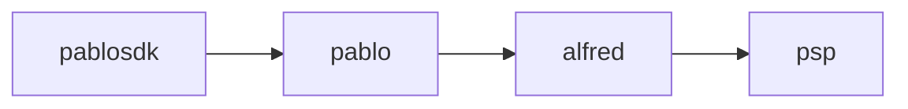

Using Pact. Relies on pact [CLI tools] on path.

[CLI tools]: https://github.com/pact-foundation/pact-ruby-standalone/releases

# Structure

This POC is exploring how to write Consumer Driver Contract (CDC) tests to
show where a break is introduced and reducing the need for cumbersome and
slow End To End tests (E2E). We will do this by introducing this call chain 
which involves services owned by four different teams.

Each of these pieces are used to complete a payment flow.

We will handle these scenarios:

1. **Create** an _intent to pay_ and get a list of available _payment methods_
2. **Update** _the intent_ with a new _amount_ to pay
3. **Confirm** _the intent_ using a specified _instrument_ which belongs to 
   a _payment method_
4. Receive a **callback** to confirm the successful payment
